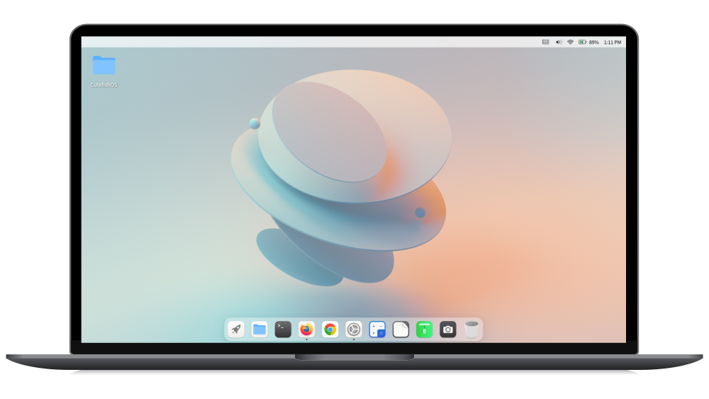

# CutefishOS's documentation 

CutefishOS is a Linux desktop operating system that focuses on simplicity, beauty and practicality. Our goal is to provide users with a comfortable interface design, a better user experience, and meet the needs of various scenarios.



```{toctree}
---
maxdepth: 3
caption: Development
hidden: true
glob: true
---
development/introduction
```

```{toctree}
---
maxdepth: 3
caption: FishUI
hidden: true
glob: true
---
fishui/appmenu
```